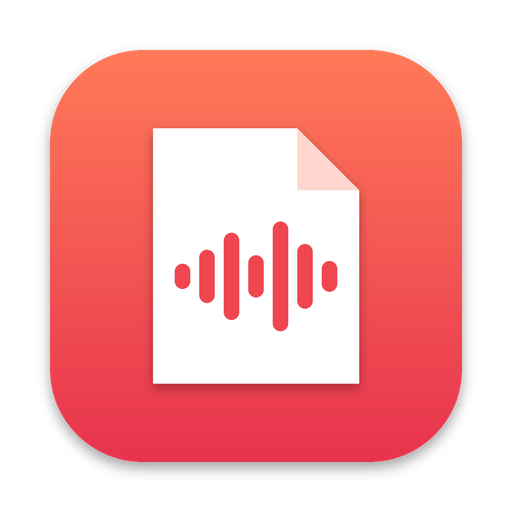

  

<h1 align="center">Earnote</h1>

  <b>Free, open-source AI meeting notes for macOS.</b> 
  Records meetings, calls and lectures, transcribes them <i>on your Mac</i> and writes structured notes into Notion, Obsidian, Apple Notes and more.

  <b><a href="https://louiskl.github.io/Earnote/">earnote website</a></b> ·
  <a href="https://github.com/louiskl/Earnote/releases/latest/download/Earnote.dmg">download</a>

  <a href="#deutsch">🇩🇪 Deutsch</a> · <a href="#english">🇬🇧 English</a>

---

## English

### Why Earnote?

AI meeting notes are great, but usually tied to one app and a monthly subscription. Earnote is a native Mac app that does the same job for free and lets **you** choose:

- **where the transcription runs**: always locally (Apple Speech on macOS 26 or Whisper via WhisperKit)
- **which AI writes the notes**: by default its own on-device model (one download, then private, free and offline), or Apple Intelligence, Ollama, LM Studio, Claude, OpenAI, Gemini, Mistral, any OpenAI‑compatible server, or your existing Claude Code / Codex subscription
- **where the notes end up**: Notion, Obsidian, Logseq, Apple Notes, a Markdown folder, Bear, Craft — and tasks into Reminders, Things or Todoist

### Features

| | |
|---|---|
| 🎙 **Microphone + system audio** | Captures the other participants in Zoom, Teams, Meet … using Core Audio process taps. No BlackHole or other virtual audio device. |
| 📞 **Call detection** | Earnote notices when Zoom, Teams, Webex, FaceTime, Slack or a browser call uses your mic and offers to record with a small pop-up. It can also stop the recording when the call ends. |
| 🗂 **Your own categories** | Lecture, client call, interview … each with its own icon, color, summary instructions and export targets. |
| 🗣 **Speaker separation** | Labels segments as “Me” / “Others” by comparing mic and system audio. |
| ⏱ **Long recordings** | Handles 3+ hour lectures. Audio is processed in chunks and long transcripts are summarized with map-reduce. |
| 🧭 **Setup assistant** | Guides you through permissions, model download, AI provider and export targets. No terminal needed. |
| ⏸ **Pause & resume** | Pause a recording for off-the-record moments (⇧⌘P). Nothing is saved while paused. |
| 🔝 **Menu bar** | Start, pause or stop recordings, see live levels and recent notes. |
| 📥 **Import** | Drag any audio file into the window to transcribe it. |
| ▶️ **Player** | A slim bar under every note: play, ±15 s, and every timestamp in the note and transcript jumps to that moment. |
| 🪟 **Note and transcript side by side** | ⌘3 shows both; the transcript follows along while the audio plays. |
| 🔎 **Search** | Find a term in all transcripts, jump through the matches with ⌘G. |
| ⌨️ **Global shortcut** | ⌃⌥⌘R starts and stops a recording from any app. |
| 📅 **Calendar** | The running event gives the recording its name. You pick which calendars count. |
| 📄 **PDF & print** | Save a note as a clean study sheet or print it (⌘P). |
| 🃏 **Flashcards** | The AI turns a lecture into question/answer cards inside the note — export them as CSV for Anki. |
| ✅ **Tasks where you keep them** | Open tasks go to Apple Reminders (one list per area, so Structured picks them up), Things or Todoist. |

### Language

The interface follows your Mac: English or German. Notes are written in the language you choose under
*Settings › AI*, independent of the interface.

### Requirements

- macOS 15 or later on Apple Silicon (Intel works but is slow and can't run the local AI)
- About 2.3 GB of free space for the local AI model, 8 GB RAM or more
- macOS 26 or later for Apple Speech and Apple Intelligence

### Install

Download the latest `Earnote.dmg` from [Releases](../../releases) and drag Earnote into *Applications*.
The app is signed with an Apple Developer ID and notarized, so it opens with a double-click – no detour through System Settings.
Earnote checks once a day whether a newer version is available and shows a hint with a download link; it never installs anything on its own.

### Build from source

1. Install **Xcode 26** from the App Store.
2. Install the Metal toolchain once (needed for the on-device language model): `xcodebuild -downloadComponent MetalToolchain`
3. Open `Earnote.xcodeproj`. Xcode resolves the packages (WhisperKit, MLX) automatically.
4. Press **⌘R**.

If you add or remove source files, regenerate the project with `python3 scripts/generate_xcodeproj.py`.

To build the downloadable `dist/Earnote.dmg`, run `./scripts/build_release.sh`. With an Apple Developer ID it can also sign and notarize; see the comment at the top of the script.

### Privacy

- Audio and transcripts stay in `~/Library/Application Support/Earnote`.
- With the built-in local AI (default), nothing leaves your Mac – ideal for confidential meetings. The same is true for Apple Intelligence, Ollama and LM Studio.
- Only if you pick a cloud provider is the transcript text sent there. Earnote shows a notice when that is the case.
- API keys are stored in the macOS Keychain.

> ⚖️ **Recording other people may require their consent** (in Germany, for example, § 201 StGB applies). Always ask first. Earnote shows a reminder.

### Contributing

PRs are welcome. See [CONTRIBUTING.md](CONTRIBUTING.md) and the [roadmap](docs/ROADMAP.md).

---

## Deutsch

**Earnote** ist eine kostenlose, quelloffene Mac-App für KI-Notizen aus Meetings, Calls und Vorlesungen. Sie ist eine Alternative zu Notion AI Meeting Notes, mit freier Wahl von KI und Ablage.

- **Aufnahme** von Mikrofon und Systemton (Zoom, Teams, Meet …), ohne Zusatzsoftware, mit Pause-Funktion (⇧⌘P)
- **Call-Erkennung** mit Pop-up („Zoom erkannt – aufnehmen?“), automatisches Stoppen am Ende des Calls
- **Lokale Transkription** mit Apple-Spracherkennung (ab macOS 26) oder Whisper
- **Zusammenfassung** mit der eingebauten lokalen KI, die komplett auf deinem Mac läuft (privat, kostenlos, offline) – oder wahlweise mit Apple Intelligence, Ollama, LM Studio, Claude, OpenAI, Gemini, Mistral oder über ein bestehendes Claude-Code- bzw. Codex-Abo
- **Ablage** in Notion, Obsidian, Logseq, Apple Notizen, einem Markdown-Ordner, Bear oder Craft
- **Eigene Kategorien** mit eigenen Anweisungen für die Zusammenfassung (z. B. Vorlesung mit Prüfungshinweisen und Lernzettel)
- **Sprecher-Unterscheidung** in „Ich“ und „Andere“
- **Einrichtungsassistent** und Bedienung über die Menüleiste, ganz ohne Terminal
- **Abspielleiste** unter jeder Notiz: jede Zeitmarke springt an ihre Stelle, Notiz und Transkript auf Wunsch nebeneinander (⌘3)
- **Suche** über alle Transkripte, mit ⌘G durch die Fundstellen
- **Globales Tastenkürzel** ⌃⌥⌘R: Aufnahme aus jeder App starten und stoppen
- **Kalender**: Läuft ein Termin, heißt die Aufnahme wie er – welche Kalender zählen, wählst du selbst
- **Lernzettel als PDF** sichern oder drucken (⌘P)
- **Karteikarten**: Die KI macht Frage-Antwort-Karten aus der Vorlesung, Export als CSV für Anki
- **Aufgaben** wandern nach Apple Erinnerungen (je Bereich eine Liste, damit Structured sie mitliest), Things oder Todoist

**Installation:** `Earnote.dmg` unter [Releases](../../releases) herunterladen, öffnen und Earnote in den Programme-Ordner ziehen. Die App ist von Apple notarisiert und startet mit einem Doppelklick – ohne Umweg über die Systemeinstellungen. Earnote schaut einmal am Tag nach, ob es eine neuere Version gibt, und zeigt dann einen Hinweis mit Download-Link – installiert wird nie von allein.

**Fehler melden:** In der App unter *Einstellungen › Über › „Fehler melden …“* – damit ist der Bericht gleich mit Version, macOS und den letzten Protokollzeilen vorausgefüllt.
**Selbst bauen:** `Earnote.xcodeproj` in Xcode öffnen und mit ⌘R starten.

> ⚖️ Bitte vor jeder Aufnahme das Einverständnis aller Beteiligten einholen (§ 201 StGB).

**Beta-Tester:** Die Kurzanleitung steht in [docs/BETA.md](docs/BETA.md).
**Datenschutz:** Was wo liegt und wann die App ins Netz geht, steht in [docs/DATENSCHUTZ.md](docs/DATENSCHUTZ.md).

## License

[MIT](LICENSE)
